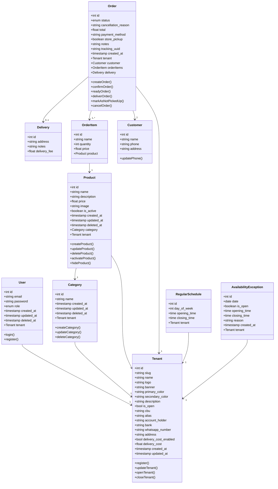
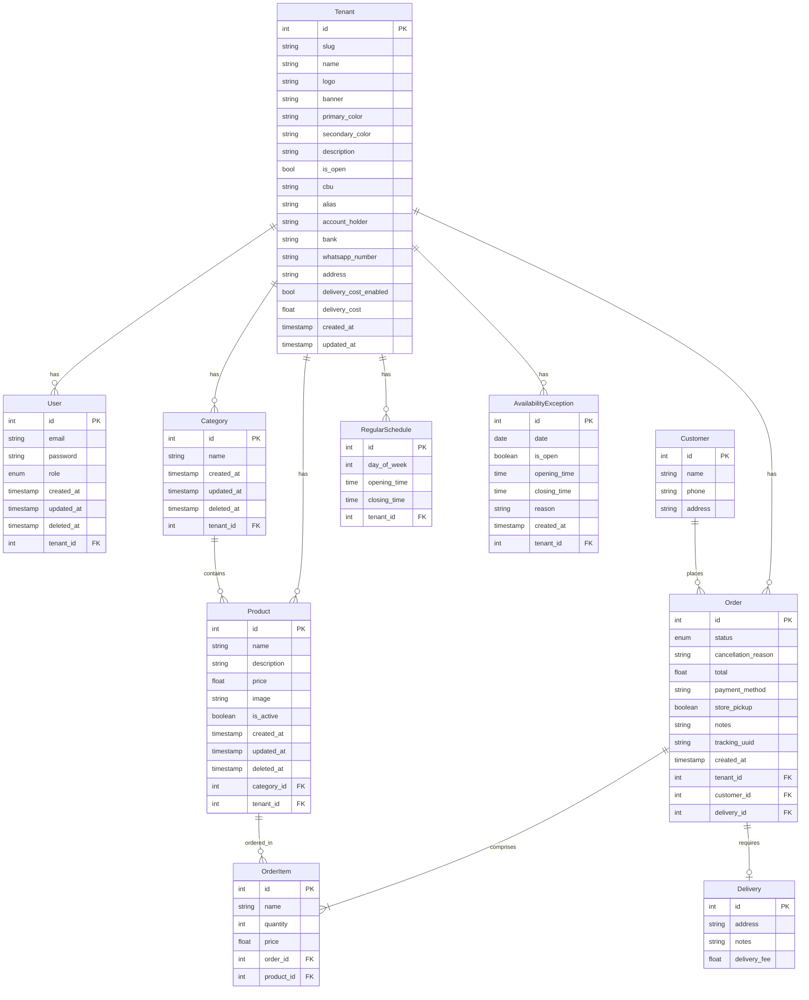
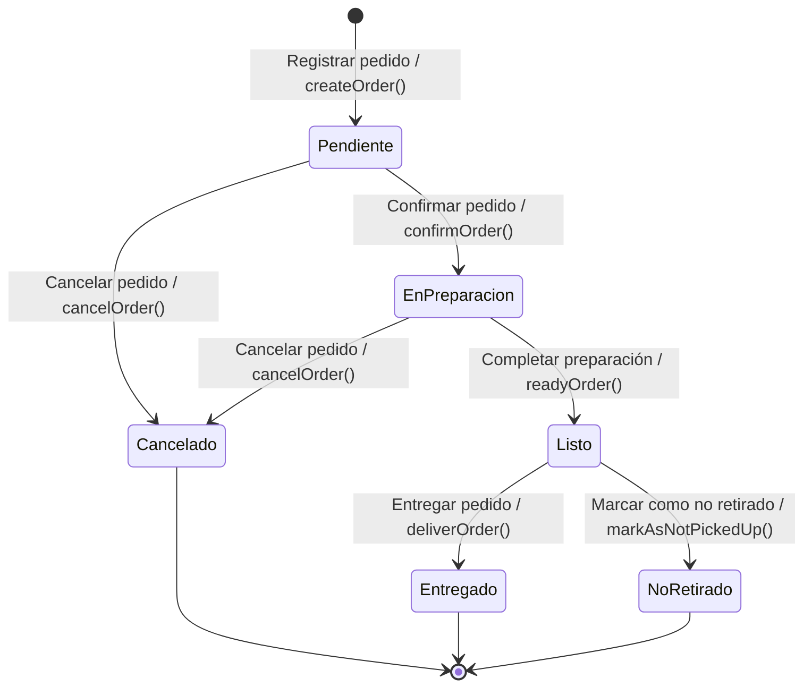

# Diagramas — Sistema de Pedidos Online

> Este archivo es referencia técnica para los agentes.
> Fuente de verdad de negocio: `/documentation/documentation_sistema_pedidos_online_V3.md`

---

## Diagrama de Clases

---

## Diagrama Entidad-Relación

---

## Diagrama Máquina de Estados

### Tabla de transiciones válidas (referencia para el agente)

| Estado actual | Acción del dueño | Estado destino | Método |
|---|---|---|---|
| `PENDIENTE` | Confirmar pedido | `EN_PREPARACION` | `confirmOrder()` |
| `PENDIENTE` | Cancelar pedido | `CANCELADO` | `cancelOrder()` |
| `EN_PREPARACION` | Completar preparación | `LISTO` | `readyOrder()` |
| `EN_PREPARACION` | Cancelar pedido | `CANCELADO` | `cancelOrder()` |
| `LISTO` | Entregar pedido | `ENTREGADO` | `deliverOrder()` |
| `LISTO` | Marcar como no retirado | `NO_RETIRADO` | `markAsNotPickedUp()` |
| `ENTREGADO` | — | — | Estado terminal |
| `CANCELADO` | — | — | Estado terminal |
| `NO_RETIRADO` | — | — | Estado terminal |

> **Nota de implementación:** Los nombres de estado en el enum de TypeScript usan UPPER_SNAKE_CASE: `PENDIENTE`, `EN_PREPARACION`, `LISTO`, `ENTREGADO`, `CANCELADO`, `NO_RETIRADO`.

---

## Diagrama de Casos de Uso

> No existe sintaxis Mermaid estándar para diagramas de casos de uso. Se representa como lista estructurada por actor.

### Actores

- **Cliente** — usuario final, no requiere registro ni login.
- **Owner** — dueño del negocio, requiere autenticación JWT.

---

### Cliente

| Caso de uso | Descripción |
|---|---|
| Consultar menú | Ver productos organizados por categoría del negocio |
| Registrar pedido | Armar carrito y completar checkout (CU-01) |
| Consultar estado de pedido | Ver stepper de estados en `/pedido/:uuid` vía SSE (CU-08) |
| Seguir pedido por WhatsApp | Agregar teléfono para recibir notificaciones (CU-07) |

---

### Owner

**Sesión**

| Caso de uso | Descripción |
|---|---|
| Iniciar sesión | Login con email y contraseña, recibe JWT con `userId` y `tenantId` |
| Registrarse | Incluye: registrar negocio (nombre, apariencia, datos bancarios) |

**Pedidos**

| Caso de uso | Descripción |
|---|---|
| Consultar pedidos recibidos | Lista de pedidos con polling cada 20s |
| Registrar pedido manual | Por si el pedido llega por otra fuente (teléfono, etc.) |
| Confirmar pedido | `PENDIENTE` → `EN_PREPARACION` |
| Completar preparación | `EN_PREPARACION` → `LISTO` |
| Entregar pedido | `LISTO` → `ENTREGADO` |
| Marcar como no retirado | `LISTO` → `NO_RETIRADO` |
| Cancelar pedido | `PENDIENTE` o `EN_PREPARACION` → `CANCELADO` |
| Notificar cliente por WhatsApp | Genera link pre-armado al cambiar estado (CU-06) |

**Productos**

| Caso de uso | Descripción |
|---|---|
| Consultar menú | Ver productos del negocio en el panel admin |
| Crear producto | Con foto, descripción y precio (CU-02) |
| Modificar producto | Editar campos del producto |
| Eliminar producto | Soft delete — preserva historial de pedidos |
| Activar producto | Volver a mostrar un producto oculto |
| Ocultar producto | Quitar del menú público sin eliminar (CU-03) |

**Categorías**

| Caso de uso | Descripción |
|---|---|
| Consultar categorías | Ver categorías del negocio |
| Crear categoría | Agregar nueva categoría al menú |
| Modificar categoría | Editar nombre de categoría |
| Eliminar categoría | Soft delete de la categoría |

**Configuración del negocio**

| Caso de uso | Descripción |
|---|---|
| Modificar datos de negocio | Nombre, logo, colores, WhatsApp, datos bancarios (CU-04) |
| Registrar cierre temporal | Deshabilita el carrito sin bajar el sitio (CU-05) |
| Registrar apertura de local | Reactiva el carrito |
| Consultar estadísticas básicas | Resumen del día: pedidos, facturado, pendientes |
