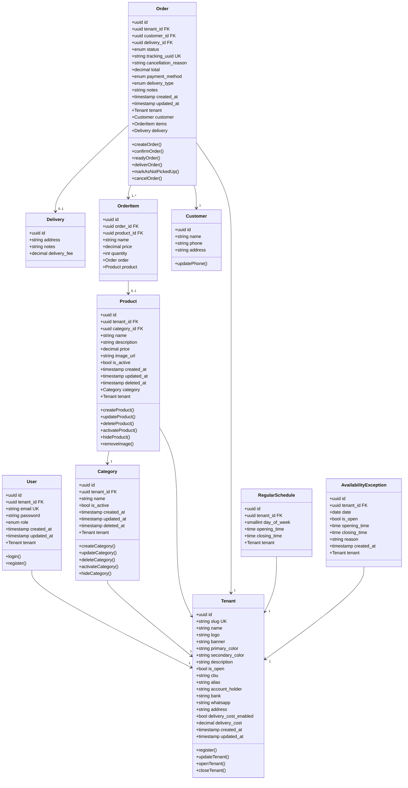
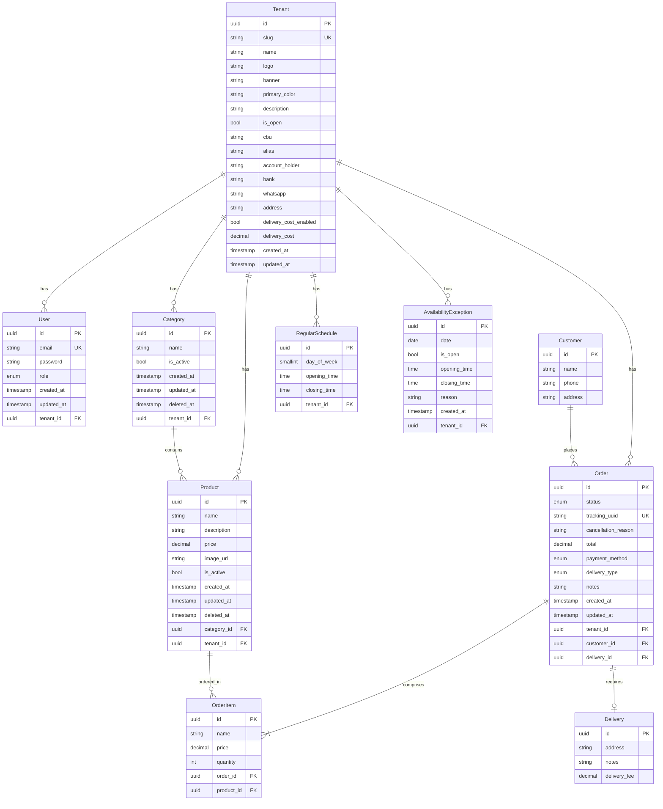
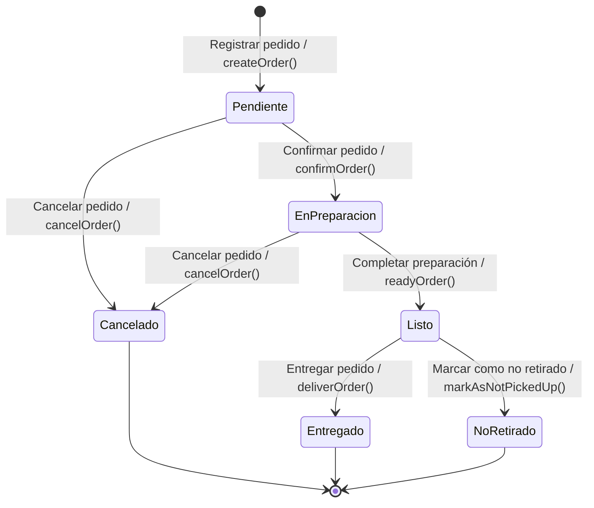

# Diagramas — Sistema de Pedidos Online

> Este archivo es referencia técnica para los agentes.
> Fuente de verdad de negocio: `/documentation/documentation_sistema_pedidos_online_V3.md`

---

## Diagrama de Clases

```mermaid
classDiagram

    class Tenant {
        +uuid id
        +string slug UK
        +string name
        +string logo
        +string banner
        +string primary_color
        +string secondary_color
        +string description
        +bool is_open
        +string cbu
        +string alias
        +string account_holder
        +string bank
        +string whatsapp
        +string address
        +bool delivery_cost_enabled
        +decimal delivery_cost
        +timestamp created_at
        +timestamp updated_at

        +register()
        +updateTenant()
        +openTenant()
        +closeTenant()
    }

    class User {
        +uuid id
        +uuid tenant_id FK
        +string email UK
        +string password
        +enum role
        +timestamp created_at
        +timestamp updated_at
        +Tenant tenant

        +login()
        +register()
    }

    class Category {
        +uuid id
        +uuid tenant_id FK
        +string name
        +bool is_active
        +timestamp created_at
        +timestamp updated_at
        +timestamp deleted_at
        +Tenant tenant

        +createCategory()
        +updateCategory()
        +deleteCategory()
        +activateCategory()
        +hideCategory()
    }

    class Product {
        +uuid id
        +uuid tenant_id FK
        +uuid category_id FK
        +string name
        +string description
        +decimal price
        +string image_url
        +bool is_active
        +timestamp created_at
        +timestamp updated_at
        +timestamp deleted_at
        +Category category
        +Tenant tenant

        +createProduct()
        +updateProduct()
        +deleteProduct()
        +activateProduct()
        +hideProduct()
        +removeImage()
    }

    class Order {
        +uuid id
        +uuid tenant_id FK
        +uuid customer_id FK
        +uuid delivery_id FK
        +enum status
        +string tracking_uuid UK
        +string cancellation_reason
        +decimal total
        +enum payment_method
        +enum delivery_type
        +string notes
        +timestamp created_at
        +timestamp updated_at
        +Tenant tenant
        +Customer customer
        +OrderItem items
        +Delivery delivery

        +createOrder()
        +confirmOrder()
        +readyOrder()
        +deliverOrder()
        +markAsNotPickedUp()
        +cancelOrder()
    }

    class Delivery {
        +uuid id
        +string address
        +string notes
        +decimal delivery_fee
    }

    class OrderItem {
        +uuid id
        +uuid order_id FK
        +uuid product_id FK
        +string name
        +decimal price
        +int quantity
        +Order order
        +Product product
    }

    class Customer {
        +uuid id
        +string name
        +string phone
        +string address

        +updatePhone()
    }

    class RegularSchedule {
        +uuid id
        +uuid tenant_id FK
        +smallint day_of_week
        +time opening_time
        +time closing_time
        +Tenant tenant
    }

    class AvailabilityException {
        +uuid id
        +uuid tenant_id FK
        +date date
        +bool is_open
        +time opening_time
        +time closing_time
        +string reason
        +timestamp created_at
        +Tenant tenant
    }

    %% Relaciones
    User --> "1" Tenant
    Category --> "1" Tenant

    Product --> "1" Tenant
    Product --> "1" Category

    Order --> "1" Tenant
    Order --> "1..*" OrderItem
    OrderItem --> "0..1" Product

    Order --> "1" Customer
    Order --> "0..1" Delivery

    RegularSchedule --> "1" Tenant
    AvailabilityException --> "1" Tenant
```

> **Todas las PK/FK son `UUID`** (`uuid PRIMARY KEY DEFAULT uuid_generate_v4()`). No hay ids incrementales.
> Los importes (`price`, `total`, `delivery_fee`, `delivery_cost`) son `decimal(10,2)`.

### Agregado `Order`

`Order` es la raíz de su agregado. `Customer`, `Delivery` y `OrderItem` son **entidades internas del agregado**: viven en `src/modules/orders/entities/` y **no tienen `tenant_id` propio**. Se aíslan a través de `order.tenant_id`.

`Customer` y `Delivery` son snapshots del momento del pedido (datos del cliente y datos de envío + `delivery_fee` copiado del tenant). `OrderItem` es el snapshot de `name` y `price` del producto.

---

## Diagrama Entidad-Relación

```mermaid
erDiagram
    Tenant {
        uuid id PK
        string slug UK
        string name
        string logo
        string banner
        string primary_color
        string description
        bool is_open
        string cbu
        string alias
        string account_holder
        string bank
        string whatsapp
        string address
        bool delivery_cost_enabled
        decimal delivery_cost
        timestamp created_at
        timestamp updated_at
    }

    User {
        uuid id PK
        string email UK
        string password
        enum role
        timestamp created_at
        timestamp updated_at
        uuid tenant_id FK
    }

    Category {
        uuid id PK
        string name
        bool is_active
        timestamp created_at
        timestamp updated_at
        timestamp deleted_at
        uuid tenant_id FK
    }

    Product {
        uuid id PK
        string name
        string description
        decimal price
        string image_url
        bool is_active
        timestamp created_at
        timestamp updated_at
        timestamp deleted_at
        uuid category_id FK
        uuid tenant_id FK
    }

    Order {
        uuid id PK
        enum status
        string tracking_uuid UK
        string cancellation_reason
        decimal total
        enum payment_method
        enum delivery_type
        string notes
        timestamp created_at
        timestamp updated_at
        uuid tenant_id FK
        uuid customer_id FK
        uuid delivery_id FK
    }

    Delivery {
        uuid id PK
        string address
        string notes
        decimal delivery_fee
    }

    OrderItem {
        uuid id PK
        string name
        decimal price
        int quantity
        uuid order_id FK
        uuid product_id FK
    }

    Customer {
        uuid id PK
        string name
        string phone
        string address
    }

    RegularSchedule {
        uuid id PK
        smallint day_of_week
        time opening_time
        time closing_time
        uuid tenant_id FK
    }

    AvailabilityException {
        uuid id PK
        date date
        bool is_open
        time opening_time
        time closing_time
        string reason
        timestamp created_at
        uuid tenant_id FK
    }

    Tenant ||--o{ User : "has"
    Tenant ||--o{ Category : "has"
    Tenant ||--o{ Product : "has"
    Tenant ||--o{ Order : "has"
    Tenant ||--o{ RegularSchedule : "has"
    Tenant ||--o{ AvailabilityException : "has"
    Category ||--o{ Product : "contains"
    Order ||--|{ OrderItem : "comprises"
    Product ||--o{ OrderItem : "ordered_in"
    Customer ||--o{ Order : "places"
    Order ||--o| Delivery : "requires"
```

> **Nombres reales de tabla:** `tenants`, `users`, `categories`, `products`, `orders`, `order_items`, `customers`, `deliveries`, `regular_schedules`, `availability_exceptions`.
> **Soft delete:** solo `products` y `categories` tienen `deleted_at`. `users` **no** tiene `deleted_at`.
> **Enums:** `orders.status` → `OrderStatus`; `orders.payment_method` → `PaymentMethod`; `orders.delivery_type` → `DeliveryType`; `users.role` → `UserRole`.
> `OrderItem`, `Customer` y `Delivery` **no** tienen `tenant_id`: se aíslan vía `orders.tenant_id`.

---

## Diagrama Máquina de Estados

```mermaid
stateDiagram-v2

    [*] --> Pendiente: Registrar pedido / createOrder()

    Pendiente --> EnPreparacion: Confirmar pedido / confirmOrder()
    EnPreparacion --> Listo: Completar preparación / readyOrder()

    Pendiente --> Cancelado: Cancelar pedido / cancelOrder()
    EnPreparacion --> Cancelado: Cancelar pedido / cancelOrder()

    Listo --> Entregado: Entregar pedido / deliverOrder()
    Listo --> NoRetirado: Marcar como no retirado / markAsNotPickedUp()

    Cancelado --> [*]
    Entregado --> [*]
    NoRetirado --> [*]
```

### Tabla de transiciones válidas (referencia para el agente)

| Estado actual | Acción del dueño | Estado destino | Método |
|---|---|---|---|
| `PENDIENTE` | Confirmar pedido | `EN_PREPARACION` | `confirmOrder()` |
| `PENDIENTE` | Cancelar pedido | `CANCELADO` | `cancelOrder()` |
| `EN_PREPARACION` | Completar preparación | `LISTO` | `readyOrder()` |
| `EN_PREPARACION` | Cancelar pedido | `CANCELADO` | `cancelOrder()` |
| `LISTO` | Entregar pedido | `ENTREGADO` | `deliverOrder()` |
| `LISTO` | Marcar como no retirado | `NO_RETIRADO` | `markAsNotPickedUp()` |
| `ENTREGADO` | — | — | Estado terminal |
| `CANCELADO` | — | — | Estado terminal |
| `NO_RETIRADO` | — | — | Estado terminal |

> **Nota de implementación:** Los nombres de estado en el enum de TypeScript usan UPPER_SNAKE_CASE: `PENDIENTE`, `EN_PREPARACION`, `LISTO`, `ENTREGADO`, `CANCELADO`, `NO_RETIRADO`.

---

## Diagrama de Casos de Uso

> No existe sintaxis Mermaid estándar para diagramas de casos de uso. Se representa como lista estructurada por actor.

### Actores

- **Cliente** — usuario final, no requiere registro ni login.
- **Owner** — dueño del negocio, requiere autenticación JWT.

---

### Cliente

| Caso de uso | Endpoints |
|---|---|
| Consultar menú | `GET /:tenant/categories` + `GET /:tenant/products` (cliente) |
| Registrar pedido | Armar carrito y completar checkout (CU-01) |
| Consultar estado de pedido | Ver stepper de estados vía SSE (CU-08) |
| Seguir pedido por WhatsApp | Agregar teléfono para recibir notificaciones (CU-07) |

---

### Owner

**Sesión**

| Caso de uso | Endpoints |
|---|---|
| Iniciar sesión | Login con email y contraseña, recibe JWT con `userId` y `tenantId` |
| Registrarse | Registra negocio + usuario owner; el resto de la configuración se completa luego |
| Consultar perfil | `GET /auth/me` devuelve `email`, `tenantSlug`, `tenantName` |
| Cerrar sesión | Descartar el JWT en el cliente (no hay endpoint de revocación) |

**Pedidos**

| Caso de uso | Endpoints |
|---|---|
| Consultar pedidos recibidos | Lista paginada con polling cada 20s |
| Filtrar y contar pedidos | `GET /:tenant/orders` acepta `status`, `search`, `dateFrom`, `dateTo`, `page`, `limit` |
| Ver contadores por estado | `GET /:tenant/orders/admin/counts` |
| Registrar pedido manual | **PENDIENTE** — no existe endpoint en el código |
| Confirmar pedido | `PENDIENTE` → `EN_PREPARACION` |
| Completar preparación | `EN_PREPARACION` → `LISTO` |
| Entregar pedido | `LISTO` → `ENTREGADO` |
| Marcar como no retirado | `LISTO` → `NO_RETIRADO` |
| Cancelar pedido | `PENDIENTE` o `EN_PREPARACION` → `CANCELADO` |
| Consultar detalle de pedido | `GET /:tenant/orders/:id` |
| Notificar cliente por WhatsApp | Genera link pre-armado al cambiar estado (CU-06) |

**Productos**

| Caso de uso | Endpoints |
|---|---|
| Consultar productos | `GET /:tenant/products/admin` |
| Crear producto | Con foto, descripción y precio (CU-02) |
| Modificar producto | Editar campos del producto y/o reemplazar la imagen |
| Eliminar producto | Soft delete — preserva historial de pedidos |
| Activar producto | Volver a mostrar un producto oculto |
| Ocultar producto | Quitar del menú público sin eliminar (CU-03) |
| Quitar imagen del producto | `DELETE /:tenant/products/:id/image` pone `imageUrl` en `null` y borra el archivo |

**Categorías**

| Caso de uso | Endpoints |
|---|---|
| Consultar categorías | `GET /:tenant/categories/admin` |
| Crear categoría | Agregar nueva categoría al menú |
| Modificar categoría | Editar nombre de categoría |
| Eliminar categoría | Soft delete de la categoría |
| Activar categoría | `PATCH /:tenant/categories/:id/activate` |
| Ocultar categoría | `PATCH /:tenant/categories/:id/hide` |

**Configuración del negocio**

| Caso de uso | Endpoints |
|---|---|
| Modificar datos de negocio | `PATCH /:tenant/admin/tenants` — nombre, colores, WhatsApp, dirección, datos bancarios, logo y banner (CU-04) |
| Quitar logo | `DELETE /:tenant/admin/tenants/logo` |
| Quitar banner | `DELETE /:tenant/admin/tenants/banner` |
| Registrar cierre temporal | `isOpen: false` deshabilita el carrito sin bajar el sitio (CU-05) |
| Registrar apertura de local | `isOpen: true` reactiva el carrito |
| Consultar disponibilidad pública | `GET /:tenant/availability` (config + horarios + excepciones) |
| Gestionar horario semanal | `GET/POST /:tenant/admin/schedule`, `PATCH/DELETE /:tenant/admin/schedule/:id` |
| Gestionar excepciones de fecha | `GET/POST /:tenant/admin/exceptions`, `PATCH/DELETE /:tenant/admin/exceptions/:id` |
| Configurar costo de envío | `deliveryCostEnabled` + `deliveryCost` (se copia a `Delivery.deliveryFee` al crear el pedido) |
| Consultar estadísticas básicas | `GET /:tenant/orders/admin/stats` — resumen del día: pedidos, facturado, pendientes |
